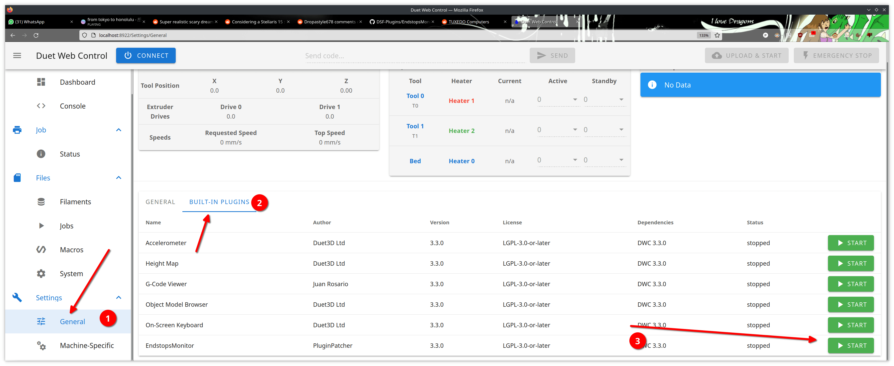

# Plugin Workspace

A Docker container to directly develop and build Duet plugins in.
The software allows developers to run the frontend/GUI side of plugins direclty on your PC, but for backend you still need a DSF-enabled 3D printer.

## How to run

Command to run in terminal are `written like this`!

### Requirements

- Linux (Windows or Mac would work too if you can get the requirements below, but I have no experience with those platforms)
- Docker and docker-compose

### Steps

- run `git clone --depth=1 https://github.com/Apyron/duet-plugin-workspace.git` to clone this repo
- `cd` to duet-plugin-workspace/docker (in the repo you just cloned)
- run `docker-compose up -d`
- run `docker exec -it docker_plugin_dev_env_1 bash` to open the terminal
- place your plugins in the plugins/ folder
    - there is a demo plugin preinstalled, so for testing purposes you can skip this step.
- to run the simulator with plugins: `run_dwc`
    - you can now go to http://localhost:8922. This will open a duet web page, click cancel if asked to connect to a printer.
- to build the plugins of choice to upload them to a Duet-enabled printer, run `build_plugn <plugin name>`
    - **note**: If you run `build_plugin` without any arguments, you get a list of plugins to build. 

In the end you should be able to laod your plugin like in the screenshot below:

